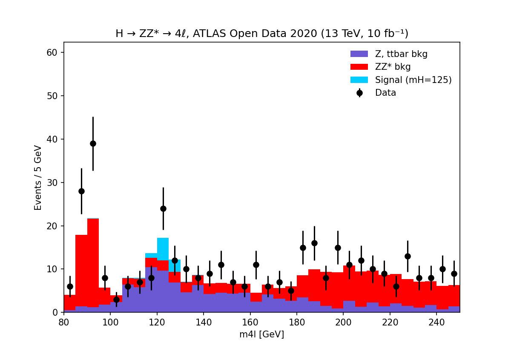

# CERN-Open-Data-Analysis

# H → ZZ* → 4ℓ with ATLAS Open Data

## Goal
Reproduce the Higgs → ZZ* → 4 lepton analysis from the ATLAS Open Data
(2020 release, 13 TeV, 10 fb⁻¹). In a second part (in progress) I extend it
with a signal/background classifier and audit its calibration and
train/test leakage.

## Data
- ATLAS 13 TeV 4-lepton samples, CERN Open Data Portal
- DOI: 10.7483/OPENDATA.ATLAS.2Y1T.TLGL (CC0)
- Educational dataset; not suited for scientific publications.

## Method
Event selection and weights follow the official ATLAS Open Data notebook:
first four leptons, total charge 0, lepton types eeee / μμμμ / eeμμ.
Simulation is weighted by cross-section, luminosity and scale factors.

## Validation
- Per-file event counts (nIn / nOut) match the official notebook.
- Data events after selection: 507 (official notebook: 507).

## Result

In the 120–130 GeV window: data = 36, background = 21.4, signal = 8.0.
This is a rough event count; no systematic uncertainties are included.

## Open question
Data exceeds the simulation at about 85–95 GeV (bins 85–90 and 90–95 GeV:
data 28 and 39 vs MC 17.9 and 21.7; rough pulls 1.9 and 2.8, including only
MC statistical uncertainty). I first suspected low MC statistics, but the MC
statistical uncertainty is small (< 1 event per bin), so this does not
explain the difference. The cause is not yet identified. This region is
away from the Higgs signal window (120–130 GeV).

## Reproduce
Click the Colab badge above and choose Runtime → Run all.
